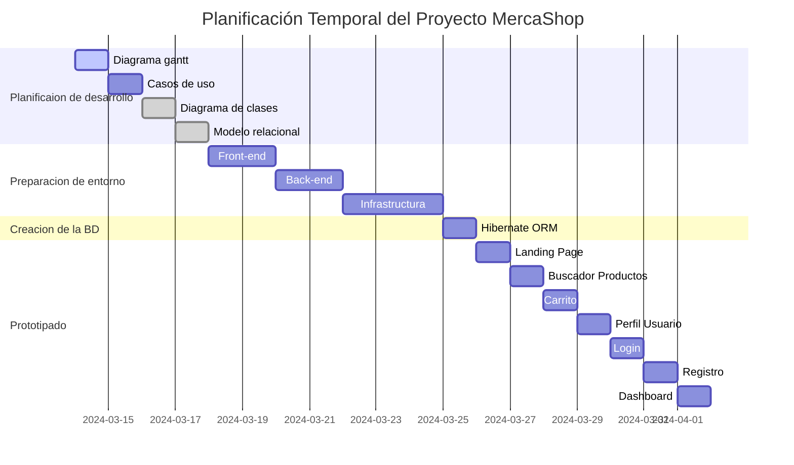

```mermaid
gantt
    TITLE       Planificación Temporal del Proyecto MercaShop

    SECTION Planificaion de desarrollo
        Diagrama gantt            :active, gantt, 2024-03-14, 1d
        Casos de uso              :    useCases, after gantt, 1d
        Diagrama de clases        :done,        uml, after useCases, 1d
        Modelo relacional         :done,    modRel, after uml, 1d
    SECTION Preparacion de entorno
        Front-end                 :         front, after modRel, 2d
        Back-end                  :         back,after front, 2d
        Infrastructura            :         infra, after back, 3d
    SECTION Creacion de la BD
        Hibernate ORM             :         orm, after infra, 1d
    SECTION Prototipado
        Landing Page              :         land, after orm, 1d
        Buscador Productos        :         search, after land, 1d
        Carrito                   :         cart, after search, 1d
        Perfil Usuario            :         profi, after cart, 1d
        Login                     :         login, after profi, 1d
        Registro                  :         singup, after login, 1d
        Dashboard                 :         dash, after singup, 1d
    SECTION Codificacion
    SECTION Validacion
    SECTION Despliegue
```
