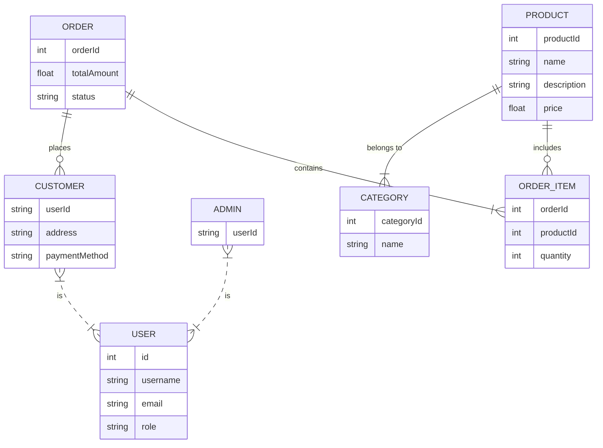

# ER Diagram

```mermaid
erDiagram
    USER {
        int id
        string username
        string email
        string role
    }
    CUSTOMER {
        string userId
        string address
        string paymentMethod
    }
    ADMIN {
        string userId
    }
    ORDER {
        int orderId
        float totalAmount
        string status
    }
    PRODUCT {
        int productId
        string name
        string description
        float price
    }
    CATEGORY {
        int categoryId
        string name
    }

    ORDER_ITEM {
        int orderId
        int productId
        int quantity
    }

    CUSTOMER }|..|{ USER : is
    ADMIN }|..|{ USER : is

    PRODUCT ||--|{ CATEGORY : "belongs to"
    PRODUCT ||--o{ ORDER_ITEM : includes
    ORDER ||--o{ CUSTOMER : places
    ORDER ||--|{ ORDER_ITEM : contains
```
