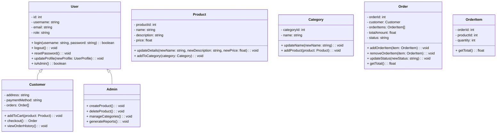

# Class Diagram

```mermaid
classDiagram
    User <|-- Customer
    User <|-- Admin
    class User {
        - id: int
        - username: string
        - email: string
        - role: string
        + login(username: string, password: string): boolean
        + logout(): void
        + resetPassword(): void
        + updateProfile(newProfile: UserProfile): void
        + isAdmin(): boolean
    }

    class Customer {
        - address: string
        - paymentMethod: string
        - orders: Order[]
        + addToCart(product: Product): void
        + checkout(): Order
        + viewOrderHistory(): void
    }

    class Admin {
        + createProduct(): void
        + deleteProduct(): void
        + manageCategories(): void
        + generateReports(): void
    }

    class Product {
        - productId: int
        - name: string
        - description: string
        - price: float
        + updateDetails(newName: string, newDescription: string, newPrice: float): void
        + addToCategory(category: Category): void
    }

    class Category {
        - categoryId: int
        - name: string
        + updateName(newName: string): void
        + addProduct(product: Product): void
    }

    class Order {
        - orderId: int
        - customer: Customer
        - orderItems: OrderItem[]
        - totalAmount: float
        - status: string
        + addOrderItem(item: OrderItem): void
        + removeOrderItem(item: OrderItem): void
        + updateStatus(newStatus: string): void
        + getTotal(): float
    }

    class OrderItem {
        - orderId: int
        - productId: int
        - quantity: int
        + getTotal(): float
    }
```
